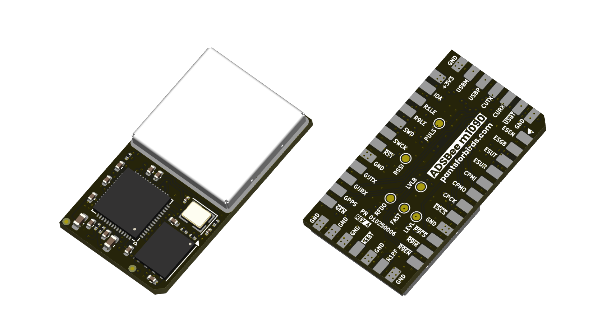
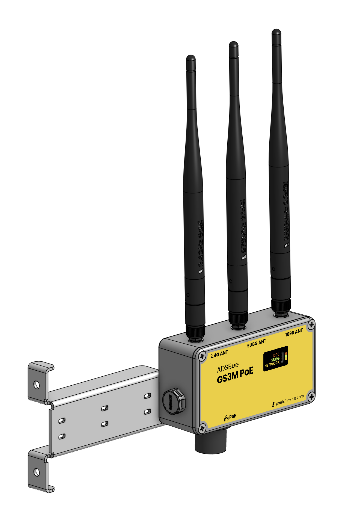

# ADSBee 1090

ADSBee 1090 is an open-source multi band radio receiver and decoder for ADS-B packets transmitted by aircraft and ground stations. ADSBee 1090 is based on an RP2040 microcontroller, and utilizes two independent PIO blocks to find and decode ADS-B messages without the need for an FPGA. ADSBee 1090 includes a radio receiver frontend with filtering and amplification, as well as a software defined comparator circuit with an adjustable trigger threshold for customizable receive sensitivity in a diverse range of RF environments.

## Features
* Decoding of 1090MHz transponder signals (ADS-B and Mode S).
* Decoding of 978MHz UAT transponder signals (ADS-B) and uplink data (FIS-B/TIS-B).
* 1x USB console input / output for changing parameters and transmitting data.
* 1x UARTs for reporting data or ingesting GNSS information.
* Built-in EEPROM for storing nonvolatile settings.
* Feature-rich AT command set for customizing baud rates, output data protocols, signal conditioning values, etc.
* Multiple supported output protocols:
    * Raw packets
    * MAVLINK1
    * MAVLINK2
    * GDL90
    * Mode S Beast
    * CSBee (custom information rich ASCII protocol)
* 2.4GHz 802.11 radio for automatic streaming of decoded values to custom endpoints on the internet. No external compute required, just add WiFi and power!
* Ethernet interface (requires external PoE pant or W5500 IC).
* GNSS module connector for MLAT and ground station location information.
* Low(ish) power draw.

## Purchasing and Support
ADSBee 1090 is a product of Pants for Birds LLC. To learn more about the project or purchase a device, please visit [pantsforbirds.com/adsbee-1090](https://pantsforbirds.com/adsbee-1090).

## General Architecture
ADSBee 1090 utilizes some basic RF hardware (SAW filters, LNA, logarithmic power detector) to amplify the received pulse-position-modulated ADS-B waveform into a pulse train that is conditioned by a comparator and fed to a PIO input pin on the RP2040. The RP2040 utilizes two PIO state machines, one for preamble detection and one for manchester decoding of the message body, to decode the ADS-Bee message. This offers significant cost and power savings over FPGA-based solutions that solve the same problem.

A filtered PWM output from the RP2040 can be used to adjust the bias of the data slicer comparator circuit on the output of the receive signal chain, allowing logarithmic adjustments in receiver sensitivity which can be used to filter out weaker ADS-B signals in congested environments or maximize sensitivity for increased receive range.

There are two devices connected to the RP2040 via a common SPI bus: a CC1312 for secondary band receive and an ESP32 S3 for networking functions.

The CC1312 can be tuned to a variety of sub-GHz frequencies to decode UAT mesages (and potentially more protocols in the future). These messages are forwarded to the RP2040 over SPI and reported through a unified interface along with the Mode S packets received by the RP2040.

The ESP32 S3 ingests raw packets from the RP2040 and maintains a separate, identical, aircraft dictionary for use in reporting over network interfaces (WiFi, Ethernet).

All three microcontrollers utilize code stored on the RP2040's external flash chip, so firmware updates are conducted by flashing a single firmware image to the RP2040, which in turn flashes updated firmware images to the CC1312 and ESP32 S3.

## Devices

The ADSBee 1090U from Pants for Birds LLC includes an RP2040, ESP32, CC1312, and custom 1090MHz RF frontend on a single PCBA, enabling all multi-band receive and networking functions (except for Ethernet, which requires an external pant).

The ADSBee m1090 is a solder-down module containing only the 1090MHz frontend and RP2040, and can be extended to have the same features by populating a CC1312 and ESP32 on its carrier board. This enables custom devices to easily integrate a subset or complete clone of the ADSBee 1090U's functions, while running the same open source firmware image. The ADSBee m1090 removes one of the two LNA stages on the ADSBee 1090U, reducing power draw and improving ultra close range performance. For equivalent maximum reception range, an external LNA can be populated on the carrier PCB.

For industrial and outdoor applications, the ADSBee 1090U is available as the GS3M PoE, a ruggedized weatherproof device connected and powered by 802.3af Power over Ethernet.

