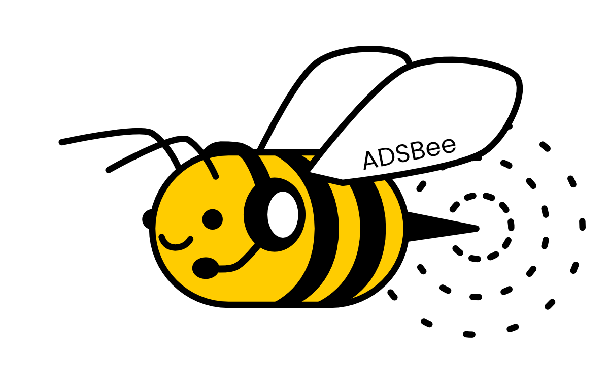
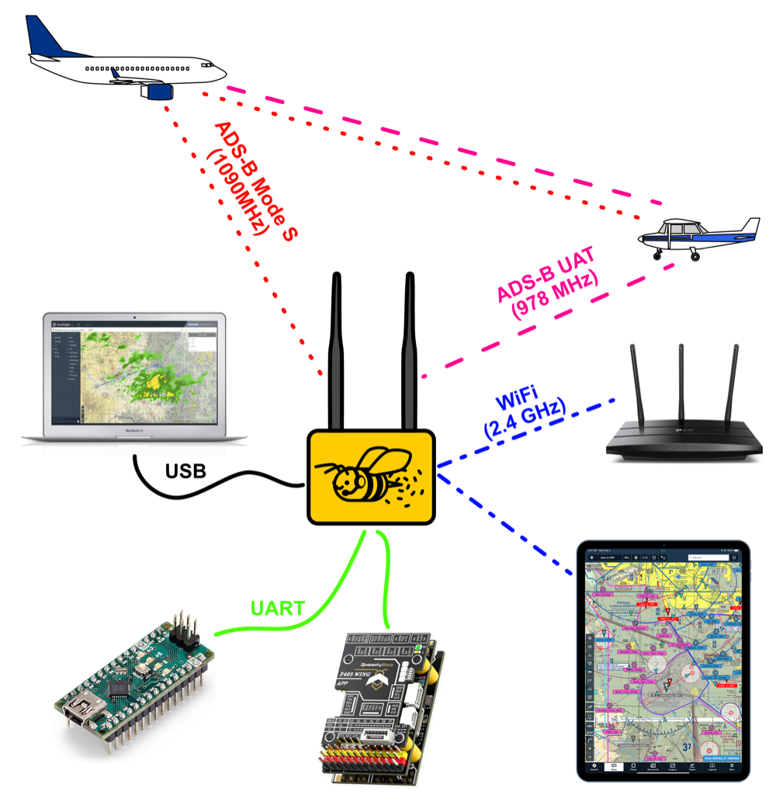
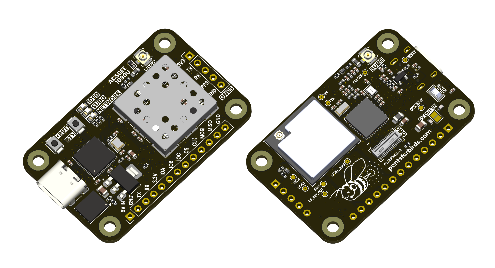
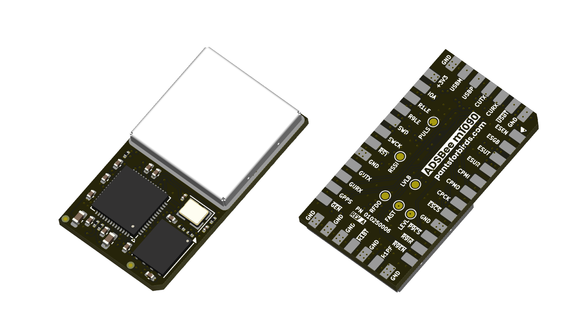
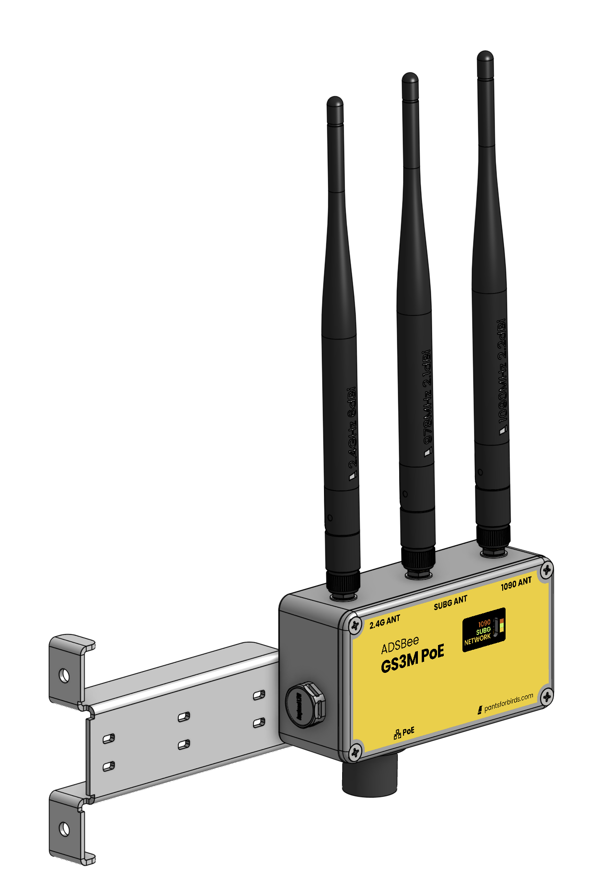
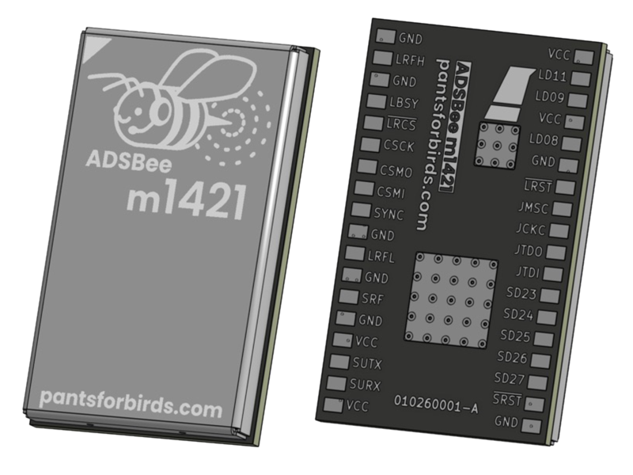
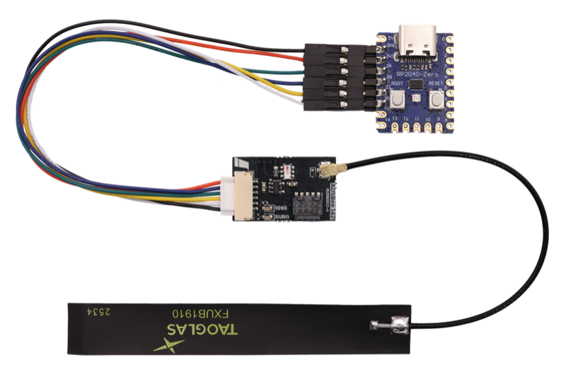

<p align="center">
  
</p>

# ADSBee

[](https://github.com/CoolNamesAllTaken/adsbee/actions/workflows/firmware.yml)
[](https://github.com/CoolNamesAllTaken/adsbee/releases?q=adsbee_1090)
[](https://github.com/CoolNamesAllTaken/adsbee/releases?q=adsbee_1421)
[](LICENSE)

ADSBee is a family of open-source, dual-band ADS-B receivers from [Pants for Birds LLC](https://pantsforbirds.com). Every ADSBee decodes 1090 MHz Mode S / ADS-B and 978 MHz UAT transmissions onboard — no SDR dongle, FPGA, or host computer required — maintains an aircraft dictionary, and streams tracked aircraft over UART (and, on the 1090 family, WiFi / Ethernet) in a wide range of output protocols. This repository holds the firmware, hardware design files, datasheets, and host software for the whole family.

<p align="center">
  
</p>

There are two product lines, which share most of their firmware (`firmware/common/`):

| | **ADSBee 1090** | **ADSBee 1421** |
|---|---|---|
| Best for | Ground stations, feeders, networked receivers | Ultra-low-power embedded / UAS detect-and-avoid |
| Processors | RP2040 + ESP32-S3 + CC1312 | TI CC1314R10 + Semtech LR2021 |
| 1090 MHz | Custom RF frontend + RP2040 PIO decoder | LR2021 OOK receiver |
| 978 MHz UAT | CC1312 sub-GHz radio | CC1314 sub-GHz radio (uplink reception selectable) |
| Interfaces | USB, UART, WiFi, Ethernet (PoE pant / W5500), GNSS | UART (AT commands), SYNC line, LR2021 SPI passthrough |
| Power | ~1W | ~19 mA at 1.8–3.3 V |
| Firmware | [`firmware/adsbee_1090/`](firmware/adsbee_1090/) | [`firmware/adsbee_1421/`](firmware/adsbee_1421/) |

## Products and Where to Buy

All ADSBee devices are designed and sold by Pants for Birds LLC. Purchasing a device is the best way to support the project. Product pages, datasheets, and the [Quick Start Guide](https://pantsforbirds.com/adsbee/quick-start/) live at [pantsforbirds.com](https://pantsforbirds.com/adsbee/).

### ADSBee 1090 family

| | |
|---|---|
| [](https://pantsforbirds.com/product/adsbee-1090u/) | **[ADSBee 1090U](https://pantsforbirds.com/product/adsbee-1090u/)** — RP2040, ESP32-S3, CC1312, and a custom 1090 MHz RF frontend on a single PCBA, enabling all multi-band receive and networking functions (Ethernet requires an external pant). [Datasheet](word/exports/datasheet_adsbee_1090.pdf) |
| [](https://pantsforbirds.com/product/adsbee-m1090/) | **[ADSBee m1090](https://pantsforbirds.com/product/adsbee-m1090/)** — solder-down module containing only the 1090 MHz frontend and RP2040. Add a CC1312 and ESP32 on your carrier board for the full 1090U feature set, running the same firmware image. Drops one of the 1090U's two LNA stages for lower power and better ultra-close-range performance; populate an external LNA on the carrier for equivalent maximum range. An [m1090 Eval Board](https://pantsforbirds.com/product/adsbee-m1090-eval-board/) is available ([datasheet](word/exports/datasheet_adsbee_m1090_eval_board.pdf)). |
| [](https://pantsforbirds.com/product/adsbee-gs3m-poe/) | **[GS3M PoE](https://pantsforbirds.com/product/adsbee-gs3m-poe/)** — the ADSBee 1090U in a ruggedized, weatherproof enclosure, connected and powered over 802.3af Power over Ethernet for industrial and outdoor installations. [Datasheet](word/exports/datasheet_gs3m_poe.pdf) |

### ADSBee 1421 family

| | |
|---|---|
| [](https://pantsforbirds.com/product/adsbee-m1421/) | **[ADSBee m1421](https://pantsforbirds.com/product/adsbee-m1421/)** — high-performance, ultra-low-power dual-band receiver module (TI CC1314R10 + Semtech LR2021). Receives 1090 MHz Mode S and 978 MHz UAT, tracks up to 400 aircraft onboard, and reports over UART. Weighs 1.85 g. [Datasheet](word/exports/datasheet_adsbee_m1421.pdf) |
| [](https://pantsforbirds.com/product/adsbee-1421-devkit/) | **[ADSBee 1421 Developer Kit](https://pantsforbirds.com/product/adsbee-1421-devkit/)** — compact carrier board for the m1421 with a power combiner so a single lightweight dual-band antenna feeds both the 1090 MHz and 978 MHz inputs. Includes the PCBA with ARM-JTAG header, wire harness, USB programmer, and a dual-band ADS-B antenna. [Datasheet](word/exports/datasheet_adsbee_1421_devkit.pdf) |

## ADSBee 1090

ADSBee 1090 is an open-source multi-band radio receiver and decoder for ADS-B packets transmitted by aircraft and ground stations. It is based on an RP2040 microcontroller and utilizes two independent PIO blocks to find and decode ADS-B messages without the need for an FPGA. ADSBee 1090 includes a radio receiver frontend with filtering and amplification, as well as a software-defined comparator circuit with an adjustable trigger threshold for customizable receive sensitivity in a diverse range of RF environments.

### Features
* Decoding of 1090 MHz transponder signals (ADS-B and Mode S).
* Decoding of 978 MHz UAT transponder signals (ADS-B) and uplink data (FIS-B/TIS-B).
* 1x USB console input / output for changing parameters and transmitting data.
* 1x UART for reporting data or ingesting GNSS information.
* Built-in EEPROM for storing nonvolatile settings.
* Feature-rich AT command set for customizing baud rates, output data protocols, signal conditioning values, etc.
* Multiple supported output protocols:
    * Raw packets
    * MAVLINK1
    * MAVLINK2
    * GDL90
    * Mode S Beast
    * Aircraft JSON
    * CSBee (custom information-rich ASCII protocol)
* 2.4 GHz 802.11 radio for automatic streaming of decoded values to custom endpoints on the internet. No external compute required, just add WiFi and power!
* Ethernet interface (requires external PoE pant or W5500 IC).
* GNSS module connector for MLAT and ground station location information.
* ~1W power draw.

### Architecture
ADSBee 1090 utilizes some basic RF hardware (SAW filters, LNA, logarithmic power detector) to amplify the received pulse-position-modulated ADS-B waveform into a pulse train that is conditioned by a comparator and fed to a PIO input pin on the RP2040. The RP2040 utilizes two PIO state machines, one for preamble detection and one for Manchester decoding of the message body, to decode the ADS-B message. This offers significant cost and power savings over FPGA-based solutions that solve the same problem.

A filtered PWM output from the RP2040 can be used to adjust the bias of the data slicer comparator circuit on the output of the receive signal chain, allowing logarithmic adjustments in receiver sensitivity which can be used to filter out weaker ADS-B signals in congested environments or maximize sensitivity for increased receive range.

There are two devices connected to the RP2040 via a common SPI bus: a CC1312 for secondary band receive and an ESP32-S3 for networking functions.

The CC1312 can be tuned to a variety of sub-GHz frequencies to decode UAT messages (and potentially more protocols in the future). These messages are forwarded to the RP2040 over SPI and reported through a unified interface along with the Mode S packets received by the RP2040.

The ESP32-S3 ingests raw packets from the RP2040 and maintains a separate, identical aircraft dictionary for use in reporting over network interfaces (WiFi, Ethernet).

All three microcontrollers utilize code stored on the RP2040's external flash chip, so firmware updates are conducted by flashing a single firmware image to the RP2040, which in turn flashes updated firmware images to the CC1312 and ESP32-S3.

## ADSBee 1421

ADSBee 1421 is an ultra-low-power dual band ADS-B receiver, built around a TI CC1314R10 low-power RF MCU and a Semtech LR2021 radio. The LR2021 provides best-in-class sensitivity for the high-baud-rate OOK 1090 MHz Mode S waveform, while the CC1314's sub-GHz RF core receives 978 MHz UAT and its Cortex-M33 does all demodulation, FEC, decoding, and aircraft tracking. The whole receiver draws about 19 mA and weighs under 2 g, making it suited to UAS detect-and-avoid and other power- and weight-constrained applications.

### Features
* Decoding of 1090 MHz transponder signals (ADS-B and Mode S), with selectable preamble modes for range vs. message-type coverage (`AT+R1090_PREAMBLE`).
* Decoding of 978 MHz UAT transponder signals (ADS-B) and ground uplink data (FIS-B/TIS-B). Uplink reception can be disabled independently (`AT+SUBG_MODE=UAT_RX_NO_UPLINK`) to save airtime and CPU when only traffic is needed.
* Onboard aircraft dictionary for up to 400 simultaneous targets.
* UART console with a feature-rich AT command set (baud rate, output protocol, receiver position, gain, logging, …); settings persist in flash.
* Multiple supported output protocols: Raw packets, CSBee, MAVLINK1, MAVLINK2, GDL90, Mode S Beast, Aircraft JSON.
* SYNC line for host-controlled deep sleep (STANDBY with SRAM retained), which also hands the LR2021 SPI bus to an external MCU — e.g. to use the LR2021's 2.4 GHz radio for LoRa or mesh networking.
* Firmware updates over the UART ROM bootloader (no debugger needed) or JTAG.
* Ultra-low power: ~19 mA at 1.8–3.3 V.

### Architecture
The CC1314R10 runs a NoRTOS super-loop: it polls the LR2021 over SPI for 1090 MHz OOK frames, services its own RF core's UAT receptions (ADS-B and uplink are distinguished by sync word, so uplink can be switched off at the radio), runs the shared Mode S / UAT decoders and aircraft dictionary from `firmware/common/`, and reports over the console UART. A host can suspend the device by driving SYNC high; on wake the receiver re-initializes itself. See [`firmware/adsbee_1421/AGENTS.md`](firmware/adsbee_1421/AGENTS.md) for the build guide and the SYNC sleep / LR2021 bus-handoff contract, and the [m1421 datasheet](word/exports/datasheet_adsbee_m1421.pdf) for the full AT command reference.

## Repository Layout

| Path | Contents |
|---|---|
| [`firmware/`](firmware/) | All firmware. [`adsbee_1090/`](firmware/adsbee_1090/) (RP2040 `pico/`, `esp/`, CC1312 `ti/`), [`adsbee_1421/`](firmware/adsbee_1421/) (CC1314 `ti/`, RP2040-Zero `programmer/` jig), [`common/`](firmware/common/) (shared decoders, aircraft dictionary, comms, settings), `modules/` (submodules: cppAT, googletest, …), [`scripts/`](firmware/scripts/) (dev tooling), [`build.sh`](firmware/build.sh) dispatcher. |
| [`software/`](software/) | Host software: [`adsbee_1421_console/`](software/adsbee_1421_console/) (single-file Web Serial console + UART flasher for the 1421), `adsbee/` (Python package), `serial_logger/`, and `tar1090/` / `ultrafeeder/` / `ultra2/` feeder compose files. |
| [`ci/`](ci/) | Hardware-in-the-loop USB/UF2 + OTA flash test run by the self-hosted CI runner. |
| [`kicad/`](kicad/) | Hardware design files (ADSBee 1090, 1090U, frontend prototypes, panels). |
| [`3d/`](3d/) | Enclosure exports and CAD links. |
| [`ltspice/`](ltspice/), [`excel/`](excel/) | RF / analog simulations and design calculations. |
| [`affinity/`](affinity/) | Diagrams and promotional artwork sources. |
| [`word/`](word/) | Product datasheets and firmware reference guide (`.docx` sources, PDFs in [`word/exports/`](word/exports/)). |
| [`references/`](references/) | Protocol specifications and component datasheets. |
| [`images/`](images/) | Images used by this README. |

## Building and Flashing Firmware

All toolchains live in Docker containers, so the only host requirements are Docker and git.

```bash
git clone https://github.com/CoolNamesAllTaken/adsbee.git
cd adsbee
bash firmware/scripts/setup_dev.sh        # init submodules + install the pre-commit version-check hook
bash firmware/build.sh adsbee_1090        # RP2040 + ESP32-S3 + CC1312 -> combined.uf2
bash firmware/build.sh adsbee_1421        # CC1314R10 -> adsbee_1421-<version>.hex
```

* **[`firmware/README.md`](firmware/README.md)** — prerequisites, the build dispatcher, build targets and outputs.
* **[`firmware/AGENTS.md`](firmware/AGENTS.md)** — firmware architecture overview and the version-management rules.
* **ADSBee 1090:** [`firmware/adsbee_1090/Developers_Guide.md`](firmware/adsbee_1090/Developers_Guide.md) covers the three-processor build order, flashing (`combined.uf2` over USB BOOTSEL, or OTA through the ESP32 web interface), and recovery.
* **ADSBee 1421:** [`firmware/adsbee_1421/AGENTS.md`](firmware/adsbee_1421/AGENTS.md) covers the build; flash over JTAG with a J-Link ([`firmware/adsbee_1421/ti/README.md`](firmware/adsbee_1421/ti/README.md)), or over UART using the ROM bootloader via the [RP2040-Zero programmer jig](firmware/adsbee_1421/programmer/README.md) (included in the Developer Kit) or the **Upload Firmware** button in the [web console](software/adsbee_1421_console/README.md).

Prebuilt firmware is published on the [Releases page](https://github.com/CoolNamesAllTaken/adsbee/releases). Releases are tagged per product as `adsbee_1090-<major>.<minor>.<patch>` and `adsbee_1421-<major>.<minor>.<patch>` (release candidates carry an `-rcN` suffix). `AT+DEVICE_INFO?` reports the firmware version running on a device.

## Support, Bugs, and Feature Requests

* **Getting started / using a device:** start with the [Quick Start Guide](https://pantsforbirds.com/adsbee/quick-start/) and the product datasheets in [`word/exports/`](word/exports/) (AT command reference, reporting protocols, pinouts).
* **Purchasing, orders, warranty, and hardware support:** contact Pants for Birds through [pantsforbirds.com/contact](https://pantsforbirds.com/contact/).
* **Firmware / software bugs:** open a [GitHub Issue](https://github.com/CoolNamesAllTaken/adsbee/issues). Please include:
  * which product (1090U, m1090, GS3M PoE, m1421, 1421 Developer Kit) and the output of `AT+DEVICE_INFO?` (part code and firmware version);
  * what you expected vs. what happened, and steps to reproduce;
  * relevant console output (`AT+LOG_LEVEL=INFO` makes the device chattier) and, for the 1090 family, the web interface/feed configuration involved.
* **Feature requests and questions:** also welcome as GitHub Issues; please tag the title with the product family.

## Contributing

Contributions are welcome (bug fixes, new output protocols, decoder improvements, documentation, etc)! Please follow the steps below to contribute a change.

1. Fork the repo and create a branch from `main`.
2. Run `bash firmware/scripts/setup_dev.sh` once. It initializes submodules and installs a git pre-commit hook that enforces the version rule below.
3. Make your change. Any change under `firmware/adsbee_1090/`, `firmware/adsbee_1421/`, or `firmware/common/` must be paired with a firmware version bump for the affected product(s) (`firmware/common/coprocessor/object_dictionary.cpp` for 1090, `firmware/adsbee_1421/ti/object_dictionary/object_dictionary.cpp` for 1421; a `common/` change bumps both). Note that devices only reflash coprocessors on a version mismatch, so you will need to force a reflash or bump the software version to test your code [`firmware/AGENTS.md`](firmware/AGENTS.md). When have finished testing and go to you submit your PR, ensure that your firmware version matches the version string in main! Firmware versions are only rolled upon each release.
4. If you add or change an AT command, reporting protocol, or other user-visible behavior, update the corresponding datasheet in [`word/`](word/).
5. Build locally with `firmware/build.sh` and, for 1090 changes, run the host unit tests (`bash firmware/build.sh adsbee_1090 test`).
6. Open a pull request against `main`. [CI](https://github.com/CoolNamesAllTaken/adsbee/actions/workflows/firmware.yml) builds every target and runs the unit tests; the hardware-in-the-loop flash test runs on `main` after merge.

By contributing you agree that your contributions are licensed under the GPL-3.0.

## License

ADSBee firmware, software, and design files in this repository are released under the [GNU General Public License v3.0](LICENSE). ADSBee is a product of Pants for Birds LLC.
