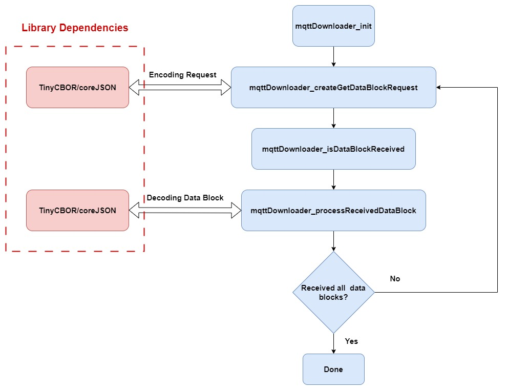

## MQTT File Streams library

In AWS IoT, a **stream** is a publicly addressable resource that is an abstraction for a list of files that can be transferred to an IoT device. Using MQTT file streams library, files from a stream can be transfer to an IoT device. The file is transferred using MQTT protocol. It supports both JSON and CBOR format to send requests and receive data.

More information about streams and MQTT based file delivery can be found [here](https://docs.aws.amazon.com/iot/latest/developerguide/mqtt-based-file-delivery.html)

## MQTT File Streams Config File

The MQTT file streams library exposes build configuration macros that are required for
building the library. A list of all the configurations and their default values
are defined in
[MQTTFileDownloader_defaults.h](source/include/MQTTFileDownloader_defaults.h). To
provide custom values for the configuration macros, a custom config file named
`MQTTFileDownloader_config.h` can be provided by the application to the library.

By default, a `MQTTFileDownloader_config.h` custom config is required to build the
library. To disable this requirement and build the library with default
configuration values, provide `MQTT_STREAMS_DO_NOT_USE_CUSTOM_CONFIG` as a compile time
preprocessor macro.

**Thus, the MQTT library can be built by either**:

- Defining a `MQTTFileDownloader_config.h` file in the application, and adding it to the
  include directories list of the library
  **OR**
- Defining the `MQTT_STREAMS_DO_NOT_USE_CUSTOM_CONFIG` preprocessor macro for the
  library build.

### MQTT File Streams library workflow

## Building MQTT File Streams library

### Dependencies

The MQTT streams library depend on the following two libraries for encoding/decoding GetStream Request and Data blocks.

1. tinyCBOR
2. coreJSON

### Build instructions

The [mqttFileDownloaderFilePaths.cmake](mqttFileDownloaderFilePaths.cmake) file contains the information of all source files and the header include path required to build this library.

## Building unit tests

### Platform Prerequisites

- For running unit tests
  - C90 compiler like gcc
  - CMake 3.13.0 or later
  - Ruby 2.0.0 or later is additionally required for the Unity test framework
    (that we use).
- For running the coverage target, gcov is additionally required.

### Steps to build Unit Tests

1. Go to the root directory of this repository.

1. Create build directory: `mkdir build && cd build`

1. Run _cmake_ while inside build directory: `cmake -S ../test`

1. Run this command to build the library and unit tests: `make all`

1. The generated test executables will be present in `build/bin/tests` folder.

1. Run `ctest` to execute all tests and view the test run summary.

## CBMC

To learn more about CBMC and proofs specifically, review the training material
[here](https://model-checking.github.io/cbmc-training).

The `test/cbmc` directory contains CBMC proofs.

In order to run these proofs you will need to install CBMC and other tools by
following the instructions
[here](https://model-checking.github.io/cbmc-training/installation.html).

## Contributing

See [CONTRIBUTING.md](./.github/CONTRIBUTING.md) for information on
contributing.

## Security

See [SECURITY](SECURITY.md) for more information.

## License

This library is licensed under the [MIT Open Source License](LICENSE).

